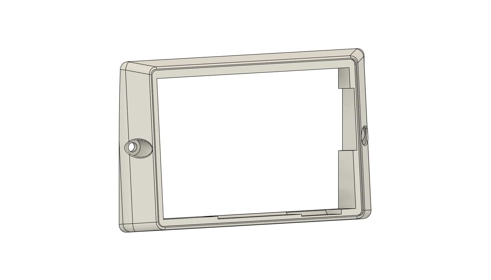

# LCC Turnout Control Panel

An ESP32-S3–based LCC/OpenLCB turnout control panel with a touch LCD user interface for model railroad layout turnout control.


## Overview

This device connects to an LCC (Layout Command Control) / OpenLCB CAN bus and provides a touchscreen interface for controlling layout turnouts. It provides an intuitive touch interface for:

- **Turnout Switchboard** — Color-coded grid showing all turnout states (Closed/Thrown/Unknown/Stale)
- **One-Tap Toggle** — Tap a tile to throw or close a turnout
- **Inline Edit & Delete** — Rename or remove turnouts directly from their tiles
- **Add Turnouts** — Manual event ID entry or bus discovery mode
- **JMRI Import** — Automatically import turnout definitions from a JMRI roster.xml on the SD card
- **State Feedback** — Consumes LCC events to show real-time turnout positions
- **Stale Detection** — Marks turnouts as stale when no update received within timeout
- **Power Saving** — Automatic backlight timeout with touch-to-wake

The controller sends and receives LCC events for turnout control. Each turnout is defined by a pair of event IDs (Normal/Reverse).

## Hardware

### Target Platform

**[Waveshare ESP32-S3 Touch LCD 4.3B](https://www.waveshare.com/esp32-s3-touch-lcd-4.3b.htm)**

| Component | Specification |
|-----------|---------------|
| MCU | ESP32-S3 (dual-core, 240 MHz) |
| Display | 4.3" RGB LCD (800×480) |
| Touch | Capacitive (GT911) |
| Storage | SD card slot (SPI via CH422G) |
| CAN | Onboard transceiver (TX: GPIO15, RX: GPIO16) |
| I/O Expander | CH422G (I2C) — controls backlight & SD CS |

### Internal Pin Connections

| Interface | Pins |
|-----------|------|
| CAN TX | GPIO 15 |
| CAN RX | GPIO 16 |
| I2C SDA | GPIO 8 |
| I2C SCL | GPIO 9 |
| SD Card | SPI via CH422G CS |

### 3D Printed Mounts

The `printed_mounts/` directory contains 3D models for mounting the display at an angle
for convenient viewing on a layout fascia or control panel.



The mount provides an ergonomic viewing angle and can be attached to a fascia or
mounted on a surface near the layout. There is a readme in the `printed_mounts/` directory with more details. Mounting to the layout can be acheived with a variety of commonly available fasteners as long as the head is smaller than 8.2mm in diameter.

## Software Stack

| Component | Version/Source |
|-----------|----------------|
| ESP-IDF | **v5.1.6** (required — see below) |
| LVGL | 8.x (ESP-IDF component) |
| OpenMRN | [Forked submodule](https://github.com/vsi5004/openmrn) |
| Touch Driver | esp_lcd_touch_gt911 |
| Image Decoder | esp_jpeg |


## Building

### Prerequisites

1. **ESP-IDF v5.1.6** — [Installation Guide](https://docs.espressif.com/projects/esp-idf/en/v5.1.6/esp32s3/get-started/index.html)
   
   > ⚠️ **Version Constraint**: ESP-IDF 5.3+ uses GCC 13.x/14.x which has a newlib/libstdc++ incompatibility causing OpenMRN compilation failures. You **must** use ESP-IDF 5.1.6 (GCC 12.2.0).

2. **Git** with submodule support

### Clone & Build

```bash
# Clone with submodules
git clone --recursive https://github.com/vsi5004/LCCControlPanelTouchscreen.git
cd LCCControlPanelTouchscreen

# Set target
idf.py set-target esp32s3

# Build
idf.py build

# Flash
idf.py -p COMx flash monitor
```

### VS Code with ESP-IDF Extension

This project is configured for the [ESP-IDF VS Code Extension](https://marketplace.visualstudio.com/items?itemName=espressif.esp-idf-extension):

1. Open the project folder in VS Code
2. Use the ESP-IDF commands from the command palette or status bar
3. Build: `ESP-IDF: Build your project`
4. Flash: `ESP-IDF: Flash your project`
5. Monitor: `ESP-IDF: Monitor your device`

## Flashing Firmware

Pre-built firmware binaries are available from the [Releases](https://github.com/vsi5004/LCCControlPanelTouchscreen/releases) page.

### Quick Flash (Recommended)

Download the merged binary from the latest release and flash to address `0x0`:

```bash
esptool.py --chip esp32s3 --port COMX write_flash 0x0 LCCControlPanelTouchscreen-vX.X.X-XXXXXXX-merged.bin
```

### Detailed Instructions

For complete flashing instructions including:
- Individual binary flashing
- ESP Flash Download Tool (Windows GUI)
- Web-based flashers
- Troubleshooting
- Post-flash configuration

See **[FLASHING.md](FLASHING.md)** for the full guide.

## SD Card Setup

The device reads configuration and turnout definitions from the SD card root.

### Quick Start

The `sdcard/` directory in this repository contains template files that you can copy directly to your SD card:

1. Format your SD card as FAT32
2. Copy all files from the `sdcard/` folder to the root of your SD card
3. Edit `nodeid.txt` with your unique LCC node ID (see below)
4. Optionally pre-populate `turnouts.json` with your turnout definitions

### File Reference

#### `nodeid.txt`

Plain text file containing the 48-bit LCC node ID in dotted hex format:

```
05.01.01.01.9F.60.00
```

**Format:** 7 groups of 2 hex digits separated by periods (case insensitive, no spaces).

**Generating a Unique Node ID:**
- Use the [OpenLCB Node ID Registry](https://registry.openlcb.org/)
- Ensure uniqueness on your LCC network

**Compile-Time Default:**

The firmware includes a default node ID (`LCC_DEFAULT_NODE_ID` in `main/app/lcc_node.cpp`) that is used only if `nodeid.txt` is missing from the SD card. For production use, always create a `nodeid.txt` file with your unique node ID.

See [FLASHING.md - Node ID Configuration](FLASHING.md#node-id-configuration) for details on customizing the compiled default.

#### `openmrn_config`

Binary file automatically created by OpenMRN. Stores LCC configuration data:

**User Info (ACDI)**
- User Name — Node name shown in LCC tools (e.g., JMRI)
- User Description — Node description

**Panel Configuration**
- Screen Backlight Timeout — Seconds before screen sleeps (0 = disabled, 10-3600)
- Stale Timeout — Seconds before a turnout with no updates is marked stale (0 = disabled)
- Query Pace — Milliseconds between event queries at startup

All settings are configurable via any LCC configuration tool (JMRI, etc.).

#### `turnouts.json`

```json
{
  "version": 1,
  "turnouts": [
    {
      "name": "Main Yard Lead",
      "event_normal": "05.01.01.01.40.00.00.00",
      "event_reverse": "05.01.01.01.40.00.00.01"
    }
  ]
}
```

#### `roster.xml` (Optional — JMRI Import)

If a JMRI `roster.xml` file is placed on the SD card, the panel will automatically
import any turnout definitions found in the `OlcbTurnoutManager` section on startup.

- Turnouts are matched by event ID — duplicates already in `turnouts.json` are skipped
- The JMRI `userName` is used as the turnout name; if absent, the `systemName` is used
- The `inverted="true"` attribute is respected (Normal/Reverse events are swapped)
- Newly imported turnouts are appended to `turnouts.json` and saved automatically

To export from JMRI: **Tables → Turnouts → File → Store → Store configuration and panels**,
then copy the resulting XML file to the SD card as `roster.xml`.

#### `splash.jpg`

Custom 800 x 480 px boot splash image (decoded via esp_jpeg). Cannot be saved as "progressive" jpg

## LCC Event Model

Each turnout is defined by a pair of LCC event IDs:

| Event | Meaning |
|-------|----------|
| Normal Event | Sent/consumed when turnout is Closed |
| Reverse Event | Sent/consumed when turnout is Thrown |

### How It Works

1. **Tap a turnout tile** on the touchscreen to toggle its state
2. **Panel sends the target event** (Normal or Reverse) to the LCC bus
3. **Turnout decoders** on the bus receive the event and move the turnout
4. **State feedback** — the panel consumes `ProducerIdentified` and `EventReport` messages to update tile colors
5. **Startup query** — on boot, the panel sends `IdentifyConsumer` for each registered event to learn current states

### Stale Detection

If a turnout has not received a state update within the configurable stale timeout,
its tile turns red to alert the operator. This helps identify turnouts that may
have lost communication or power.

## LCC Configuration (CDI)

The following settings can be configured via any LCC configuration tool (JMRI, etc.):

### User Info (ACDI)
| Setting | Description |
|---------|-------------|
| User Name | Node name displayed in LCC tools |
| User Description | Node description displayed in LCC tools |

### Panel Configuration
| Setting | Default | Range | Description |
|---------|---------|-------|--------------|
| Screen Backlight Timeout | 60 seconds | 0, 10-3600s | Idle timeout before screen off (0=disabled) |
| Stale Timeout | 300 seconds | 0-65535s | Time without update before turnout marked stale (0=disabled) |
| Query Pace | 100 ms | 10-5000ms | Delay between event queries at startup |

## User Interface

### Panel Screen (Default Boot Screen)

The panel screen displays a live control panel diagram:

- Placed turnouts rendered as Y-shape symbols with color-coded state
- **Green** = Closed, **Yellow** = Thrown, **Grey** = Unknown, **Red** = Stale
- Track segments connect turnout endpoints
- Layout auto-scaled and centered to fill the full 800×480 screen
- Tap any turnout Y-shape to toggle its state (sends LCC event)
- Floating settings gear icon in the upper-right corner for navigation

If the panel layout is empty, the device boots to the settings screen instead.

### Turnouts Tab

- Color-coded switchboard grid showing all registered turnouts
- **Green** = Closed, **Yellow** = Thrown, **Grey** = Unknown, **Red** = Stale
- **Blue border** indicates a command is pending (waiting for feedback)
- Tap any tile to toggle the turnout between Closed and Thrown
- Each tile shows three rows: **Name**, **State** (centered), and **Edit/Delete** buttons
- Tiles are arranged in a responsive flex-wrap layout (150×110px tiles)
- **Rename**: Tap the edit icon on a tile to rename it via an on-screen keyboard
- **Delete**: Tap the trash icon on a tile to remove it (with confirmation dialog)
- Automatically refreshes when turnouts are added, removed, or imported

### Add Turnout Tab

- **Manual Entry**: Enter turnout name and Normal/Reverse event IDs in dotted-hex format
- **Discovery Mode**: Toggle to listen for events on the LCC bus and select from discovered events
- On-screen keyboard for text input
- Turnouts are saved to SD card immediately after adding

### Panel Builder Tab

- WYSIWYG editor for designing the control panel layout
- Place turnouts from a filtered roller (unplaced turnouts only)
- Place track endpoints on turnout connection points
- Auto-connect endpoints to form track segments
- Drag to reposition items, rotate and mirror turnouts
- Delete with cascade removal of connected endpoints and tracks
- Zoom (0.5×–2.0×), pan, and auto-center controls
- Save layout to SD card (`panel.json`)

### Power Saving (Screen Timeout)

The screen backlight automatically turns off after a configurable idle period to
save power. Touch the screen to wake it.

- **Configurable timeout**: 0 (disabled), or 10-3600 seconds
- **Default**: 60 seconds
- **Smooth transitions**: 1-second fade-to-black before backlight off, fade-in on wake
- **Touch-to-wake**: Touch during fade or sleep immediately begins wake animation
- **Note**: The backlight is on/off only (not dimmable) due to CH422G I/O expander
  hardware limitation. Fade effect is achieved via LVGL overlay animation.

Configuration via LCC tools (JMRI, etc.):
- Set to 0 to keep screen always on
- Minimum enabled timeout is 10 seconds

### Firmware Updates (OTA)

The device supports over-the-air firmware updates via the LCC Memory Configuration
Protocol. This allows firmware updates through JMRI without physical access to the device.

**Using JMRI:**
1. Connect JMRI to your LCC network
2. Open **LCC Menu → Firmware Update**
3. Select the touchscreen controller by Node ID
4. Choose the firmware file (`build/LCCControlPanelTouchscreen.bin`)
5. Click "Download" — device reboots automatically when complete

**Safety Features:**
- **Dual OTA partitions**: New firmware written to inactive slot; old firmware preserved
- **Automatic rollback**: If new firmware fails to boot, reverts to previous version
- **Chip validation**: Rejects firmware built for wrong ESP32 variant
- **USB recovery**: Standard USB flashing always available as fallback

**How it works:**
- JMRI sends "Enter Bootloader" command to the device
- Device reboots into bootloader mode with LCD status display
- Screen shows "FIRMWARE UPDATE MODE" header with progress bar
- Firmware is streamed via LCC datagrams to memory space 0xEF
- ESP-IDF OTA APIs write to alternate partition
- On completion, new partition is activated and device reboots


## Architecture

### Task Model

| Task | Priority | Core | Responsibility |
|------|----------|------|--------------|
| lvgl_task | 2 | CPU1 | LVGL rendering via `lv_timer_handler()` |
| openmrn_task | 5 | Any | OpenMRN executor loop |
| main_task | 1 | CPU1 | Hardware init, app orchestration, stale checking |

CPU0 is dedicated to RGB LCD DMA interrupt handling for smooth display updates.

### State Flow

```
BOOT → SPLASH → LCC_INIT → MAIN_UI
                    ↓
              (timeout: degraded mode)
```

## License

BSD 2-Clause License — See [LICENSE](LICENSE) for details.

## Acknowledgments

- [OpenMRN](https://github.com/bakerstu/openmrn) — LCC/OpenLCB implementation
- [LVGL](https://lvgl.io/) — Graphics library
- [Espressif](https://www.espressif.com/) — ESP-IDF framework
