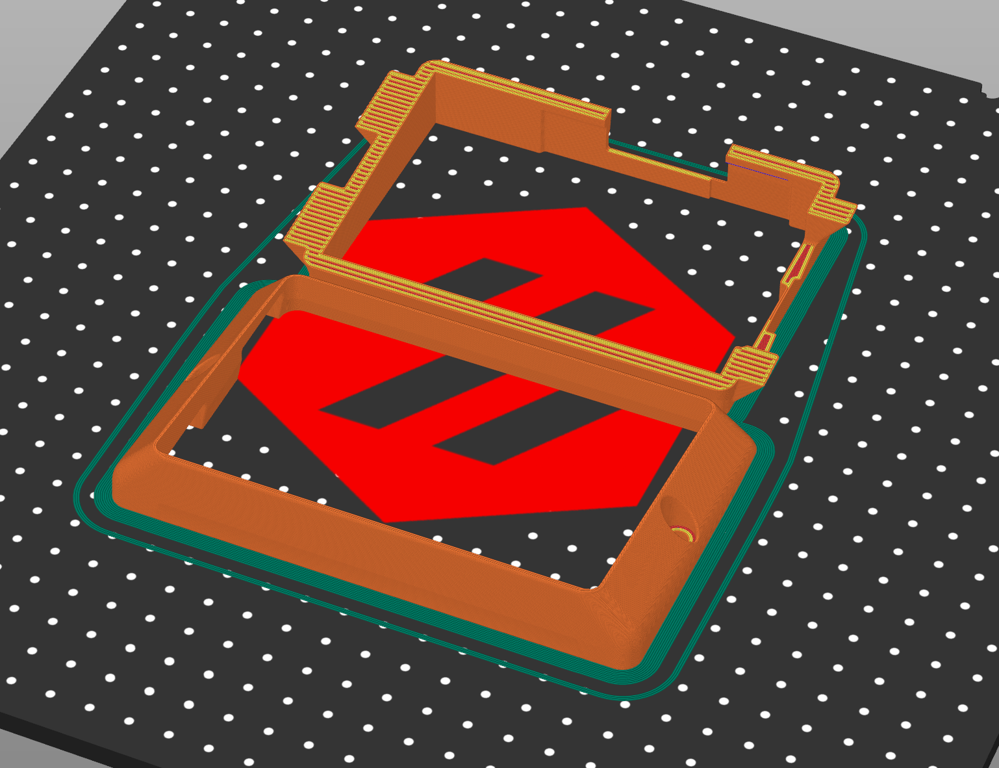
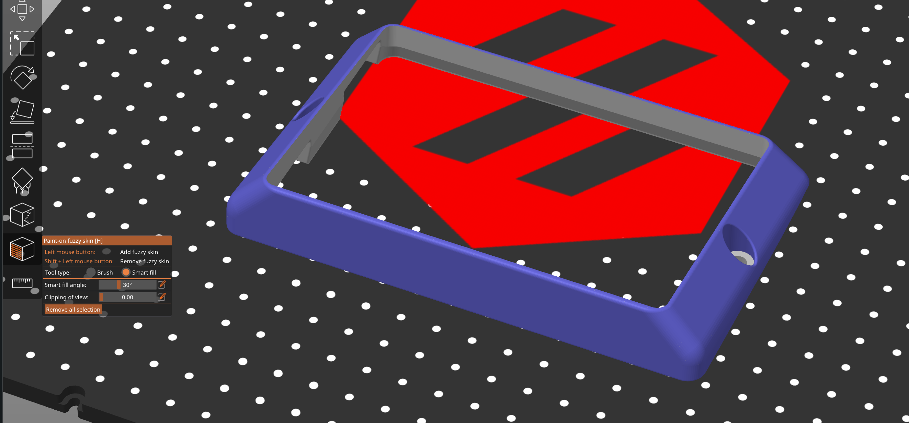
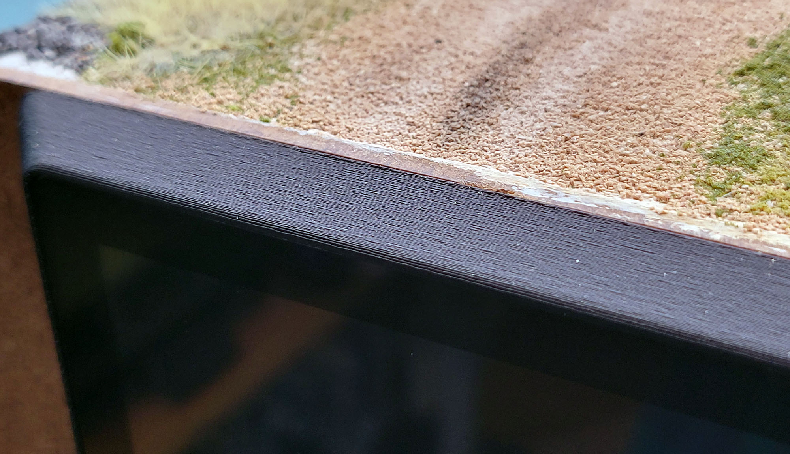
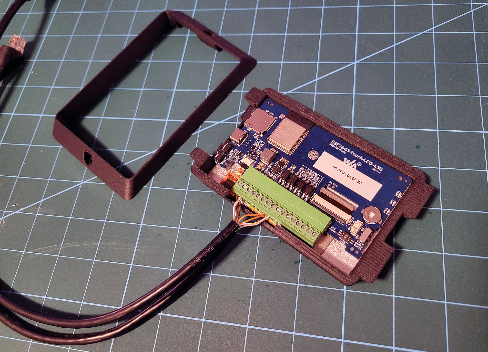

## Printed Mount Options

This folder contains two mount variants for the Waveshare ESP32-S3 Touch LCD 4.3B:

- **Single Piece** (folder: `Single Piece/`)
	- **Pros:** Stronger, simpler print, no hardware alignment needed.
	- **Cons:** Blocks access to USB and reset once the screen is glued; firmware updates must be done over LCC via JMRI.

- **Two Piece** (folder: `Two Piece/`)
	- **Pros:** USB and reset remain accessible after assembly; easier to service and re-flash over USB.
	- **Cons:** Less stiff because of thinner side walls; slightly more assembly.

### Printing Notes
- Typical FDM settings: 0.15 mm layer height, 3+ perimeters, 20–30% infill.
- Material: PLA or PETG both work, I personally went with ASA for mine.
- Supports: None.
- Orientation: See image below for optimal orientation. The parts are designed with minimal overhangs to optmize print reliability.

- Fuzzy Skin: I have found that my prints benefitted from painted on fuzzy skin on the outside faces of the Outer Shell. This helped draw the eye away from the layer lines and other 3d printing artifacts. 

I used a skin thickness of 0.1mm and a skin point distance of 0.4mm to achieve a subtle texture:

### Usage Tips
- Mount the LCD to the 3d printed mount using the double sided tape that comes pre-installed on the back of the glass panel. Not the orientation of the screen - the thicker portion of the black frame around the screen indicates the bottom of the screen and should be mounted towards the bottom of the mount, otherwise your images will be displayed upside down. 
- **Single Piece:** After mating the display to the printed mount, plan to update firmware via LCC (JMRI Firmware Update) since USB/reset are blocked.
- **Two Piece:** Do a dry fit assembly of the Screen Mount and Outer Shell, the two should fit together snugly. You can install the screen while these pieces are assembled to ensure alignment of the screen and its mount. Note which side the SD card and USB ports are and align them with the cutouts in the mount.

